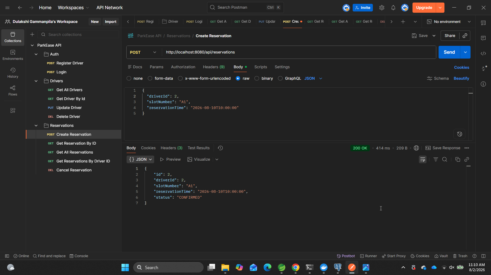
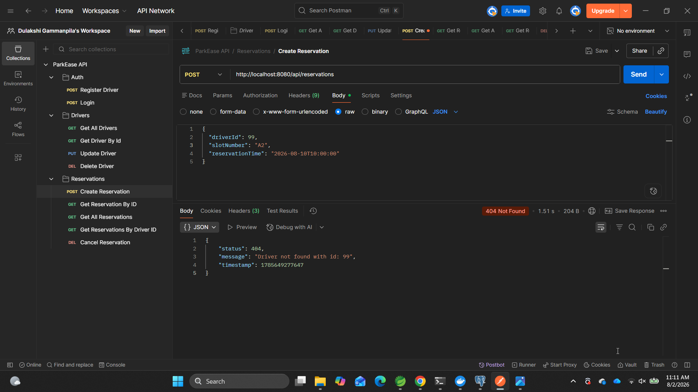
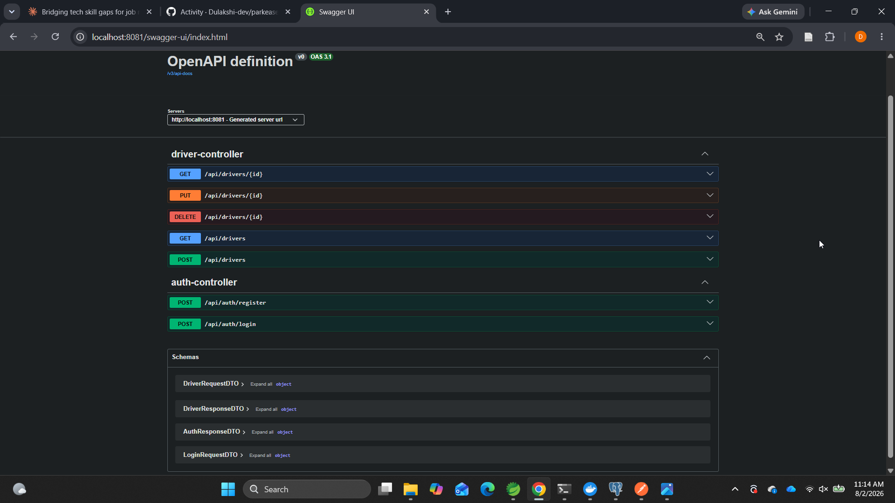
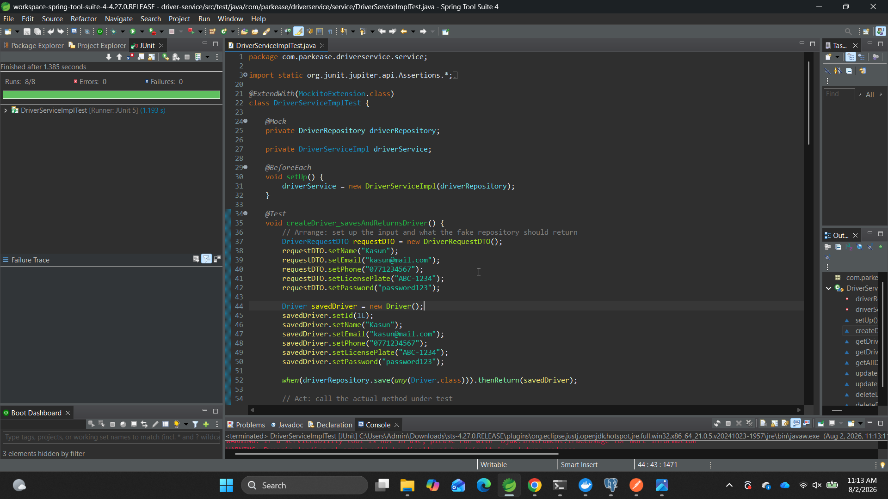
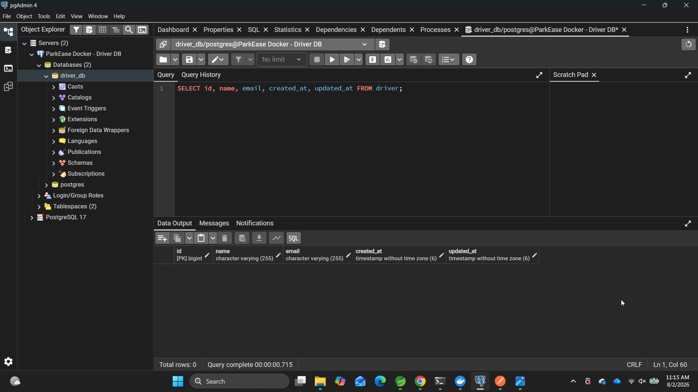
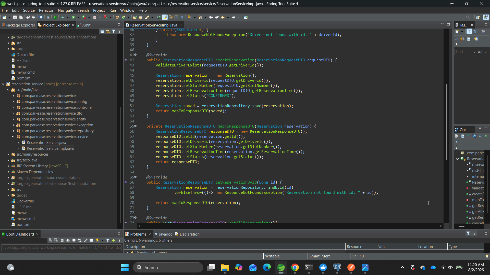

# ParkEase

A microservices-based Parking Slot Reservation System built with Spring Boot, designed to demonstrate production-style backend architecture: service decomposition, inter-service authentication, API gateway routing, and full containerization.

Built as a hands-on project to gain practical Java/Spring Boot experience ahead of software engineering internship interviews.

---

## Architecture

```
                        ┌─────────────────────┐
        Client ───────▶│     API Gateway      │   (port 8080, Spring Cloud Gateway)
                        └──────────┬──────────┘
                    ┌──────────────┴──────────────┐
                    ▼                             ▼
        ┌───────────────────────┐     ┌────────────────────────────┐
        │    Driver Service     │     │   Reservation Service      │
        │    (port 8081)        │     │   (port 8082)              │
        │                       │     │                            │
        │ - Driver registration │◀───│ - Validates driver exists  │
        │ - JWT login/auth      │ API │   via authenticated REST   │
        │ - Driver CRUD         │ key │   call to Driver Service   │
        │                       │     │ - Reservation CRUD         │
        └───────────┬───────────┘     └──────────────┬─────────────┘
                    ▼                                 ▼
            ┌───────────────┐                 ┌──────────────────┐
            │  driver_db    │                 │  reservation_db  │
            │  (PostgreSQL) │                 │  (PostgreSQL)    │
            └───────────────┘                 └──────────────────┘
```

Each service owns its own database (database-per-service pattern) — there are no direct database joins across services. When Reservation Service needs to confirm a driver exists, it makes a real, authenticated HTTP call to Driver Service rather than reading its database directly.

---

## Tech Stack

- **Java 17**, **Spring Boot**
- **Spring Data JPA** + **PostgreSQL** (one database per service)
- **Spring Security** + **JWT** (JJWT) for driver authentication
- **Spring Cloud Gateway** (WebFlux) for request routing
- **Docker** + **Docker Compose** for containerization and orchestration
- **springdoc-openapi** for auto-generated Swagger/OpenAPI documentation
- **JUnit 5** + **Mockito** for unit testing
- **Maven** for build management

---

## Key Design Decisions

**Service-to-service authentication.** Driver Service's endpoints are JWT-protected for real users, but Reservation Service also needs to call `GET /api/drivers/{id}` internally to validate a driver before creating a reservation. Rather than leaving this endpoint open to the public (a security gap) or having Reservation Service impersonate a user, a shared API key (`X-Internal-Api-Key` header) authenticates service-to-service calls independently of user-facing JWT auth.

**Database-per-service.** Each service has its own PostgreSQL instance. This means Reservation Service cannot directly query driver data — it must go through Driver Service's API, enforcing a real service boundary rather than a shared-database shortcut.

**Soft cancellation over deletion.** Cancelling a reservation updates its `status` to `CANCELLED` rather than deleting the row, preserving a full booking history.

**Container-aware configuration.** The same codebase runs identically whether started directly (Maven/IDE) or via Docker Compose. Environment-variable overrides (e.g. `SPRING_DATASOURCE_URL`, `DRIVER_SERVICE_URL`) swap `localhost` references for Docker service names at the infrastructure level, without touching application code.

**Audit trail on every entity.** Both `Driver` and `Reservation` automatically track `createdAt`/`updatedAt` via Hibernate's `@CreationTimestamp`/`@UpdateTimestamp` — populated by the ORM, not manually set in application code, and verified directly against the database.

**Unit-tested service layer.** Both services' business logic (`DriverServiceImpl`, `ReservationServiceImpl`) is covered by JUnit 5 + Mockito unit tests, with the repository layer mocked out so tests run in isolation, in-memory, without a real database. Both happy-path and not-found/failure cases are tested for each CRUD operation.

---

## Getting Started

### Prerequisites
- Docker Desktop

### Run everything with one command

```bash
git clone <this-repo-url>
cd parkease
docker-compose up --build
```

This starts all 5 containers: API Gateway, Driver Service, Reservation Service, and their two PostgreSQL databases (with persistent volumes).

Once running, the entire system is accessible through the Gateway at `http://localhost:8080`.

### API Documentation (Swagger UI)

- Driver Service: `http://localhost:8081/swagger-ui.html`
- Reservation Service: `http://localhost:8082/swagger-ui.html`

Driver Service's protected endpoints can be tried directly in Swagger: log in via `/api/auth/login`, copy the returned token, click **Authorize** at the top of the page, paste the token, and every subsequent "Try it out" call will include it automatically.

### Postman Collection

A full, tested Postman collection covering every endpoint (auth, drivers, reservations) is included at `postman/ParkEase-API.postman_collection.json`. Import it directly into Postman to try the API end-to-end.

---

## Example Flow

```
1. POST /api/auth/register    → create a driver account, receive a JWT
2. POST /api/auth/login       → log in, receive a JWT
3. GET  /api/drivers          → list drivers (requires JWT)
4. POST /api/reservations     → book a slot (validates driver via internal service call)
5. GET  /api/reservations     → view all reservations
6. DELETE /api/reservations/{id} → cancel a reservation (soft cancel)
```

All requests above are routed through the API Gateway at `localhost:8080` — the client never talks to Driver Service or Reservation Service directly.

---

## Demo

**One command starts the entire system — 3 services, 2 databases:**


**Register a driver and receive a JWT:**


**Create a reservation — Reservation Service validates the driver via an authenticated call to Driver Service:**



**...and the same call correctly rejected when the driver doesn't exist — proof the cross-service validation is real, not just claimed:**



**Interactive API documentation, auto-generated from the code (Swagger/OpenAPI):**



**Unit tests passing (JUnit 5 + Mockito, repository layer mocked):**



**Audit timestamps (`createdAt`/`updatedAt`) verified directly against the database:**



**Layered project structure, per service:**



---

## What I'd Do Differently at Scale

- Replace the shared API key with a proper service-to-service auth mechanism (e.g. OAuth2 client-credentials flow, or mTLS between services)
- Add service discovery (Eureka/Consul) instead of hardcoded service URLs
- Add a config server for centralized configuration management
- Add circuit breaking (Resilience4j) around the Driver Service call from Reservation Service, so a Driver Service outage degrades gracefully instead of failing every reservation request
- Add integration tests (Testcontainers) to complement the existing unit tests, exercising the real database and full HTTP layer
- Add role-based access control (RBAC) — e.g. restricting driver deletion to an admin role — building on the existing JWT auth
- Add pagination to list endpoints (`GET /api/drivers`, `GET /api/reservations`)

---

## Project Structure

```
parkease/
├── api-gateway/
├── driver-service/
│   └── src/
│       ├── main/java/.../{entity, repository, dto, service, controller, exception, security}
│       └── test/java/.../service/DriverServiceImplTest.java
├── reservation-service/
│   └── src/
│       ├── main/java/.../{entity, repository, dto, service, controller, exception, config}
│       └── test/java/.../service/ReservationServiceImplTest.java
├── postman/
│   └── ParkEase-API.postman_collection.json
├── docs/
│   └── screenshots/
└── docker-compose.yml
```
